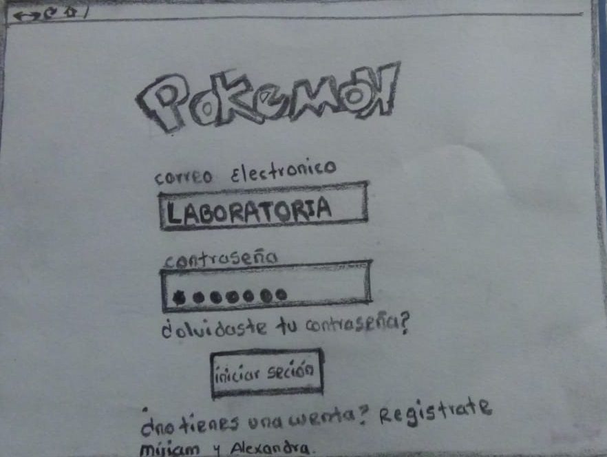
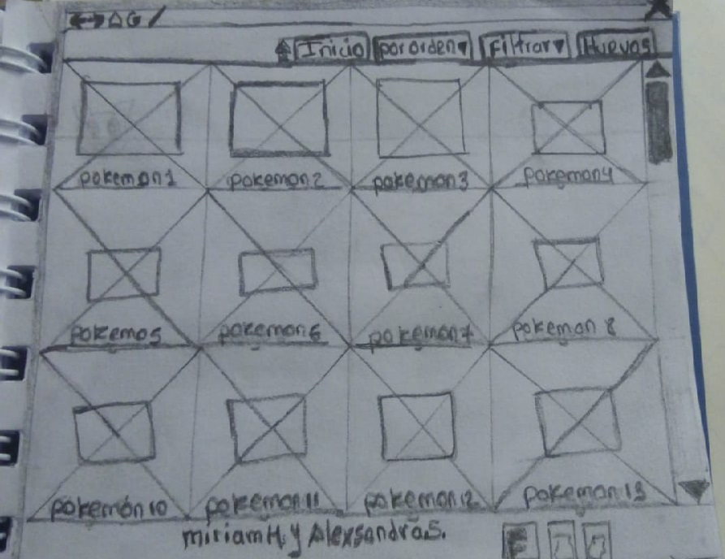
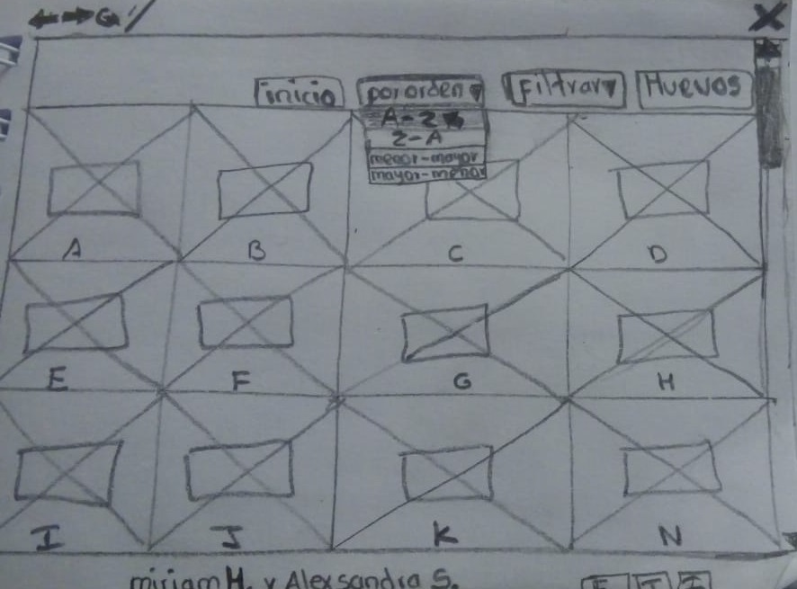

# Data Lovers

## Índice

- [Índice](#índice)
- [ título.](#titulo)
- [ resumen](#resumen)
- [ imagen final](#imagen)
- [ solucion de problemas](#solucion)
- [ investigacion ux](#investigacio-ux)
- [nuestros usuarios y los objetivos](#objetivos)
- [Explicar cómo el producto soluciona los problema](#Explicar)
- [ foto de tu primer prototipo de baja fidelidad](#papel)
- [ resumen de feedback](#resumen-de-feedback)
- [Imagen y link del prototipo de alta fidelidad final](#prototipo-alta-fidelidad)

***

## El mundo Pokemon
Es un producto dirigido a usuarios que quieren entrar al mundo de los pokemones y aprender sus caracteristicas para iniciarse en el juego de pokemon .

## imagen
------
## necesidades de dichos usuarios.
Interacción social: Ser parte de un gran grupo de compañeros de juego y las interacciones sociales que esto ofrece son parte de las razones claves que llevan a un gamer a jugar. Buscan la camaradería de las almas afines y el sentido de pertenencia.
manejo del control del juego : Los jugadores quieren un control total de todos los aspectos de su experiencia de juego, desde la ergonomía hasta la usabilidad. Adoptarán fácilmente dispositivos que les permitan alcanzar este objetivo.
tener una accesibilidad mas eficiente

## investigacio-ux

## objetivos
nuestro juego va dirigido a un publico joven ya que en un estudio reciente se logro saber que los jovenes le dedican tiempo a los juegos en linea y por eso es que decidimos dirigirnos a ellos con el objetivo de que jueguen y recomienden a sus amigos y asi ser conocidad y mejorar dea cuerdo al feedback que nos vayan dando 

## solucion
solucion de problemas.- uno de los problemas que se ve hoy en dia es que los jovenes se aislan de la sociedad incluso de sus familias es por eso que nosotros viendo  este problema hemos dado la solucion de que nuestro juego se juegue en familia y se interactue entre ellos y que sea a horas adecuadas no todo el dia y ser un juego mas interactivo con la sociedad
necesidades de dichos usuarios.- 

## Explicar

## papel
 "titulo")
 "titulo")
 "titulo")

## resumen-de-feedback

## prototipo-alta-fidelidad