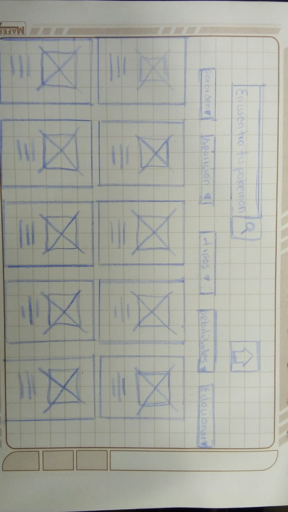

# Data Lovers

## Índice

- [Índice](#índice)
- [ título.](#titulo)
- [ resumen](#resumen)
- [ imagen final](#imagen)
- [ solucion de problemas](#solucion)
- [ investigacion ux](#investigacio-ux)
- [nuestros usuarios y los objetivos](#objetivos)
- [Explicar cómo el producto soluciona los problema](#Explicar)
- [ foto de tu primer prototipo de baja fidelidad](#papel)
- [ resumen de feedback](#resumen-de-feedback)
- [Imagen y link del prototipo de alta fidelidad final](#prototipo-alta-fidelidad)

***

## El mundo Pokemon
Es un producto dirigido a usuarios que quieren entrar al mundo de los pokemones y aprender sus caracteristicas para iniciarse en el juego de pokemon .

## imagen
------
## necesidades de dichos usuarios.
las necesidades que ellos tienen es saber mas sobre que pokemones quieren  capturar y cual es el rango de poder que tienen cada uno y cual usarian en una batalla 

## investigacio-ux

## objetivos
el objetivo es mostrar las caracteristicas de cada pokemon para que   

## solucion

## Explicar

## papel
 "titulo")
 "titulo")
 "titulo")

## resumen-de-feedback

## prototipo-alta-fidelidad